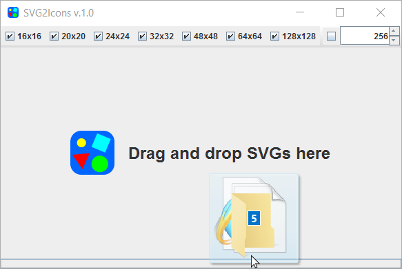
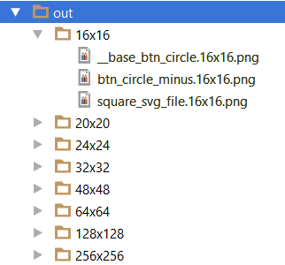

# SVG2Icons
SVG2Icons rasterize SVG to PNG icons in the following sizes: **16x16** px, **20x20** px, **24x24** px, **32x32** px, **48x48** px, **64x64** px, **128x128** px and **custom size**.

**Requirements:**  Java 8
## How to

- Download **run.bat** and **svg2icons-wd-\*.jar** under **bin** folder
- Execute **run.bat**
- Select desired icons size
- Drag and drop **SVG** files and folder

### Output directories
